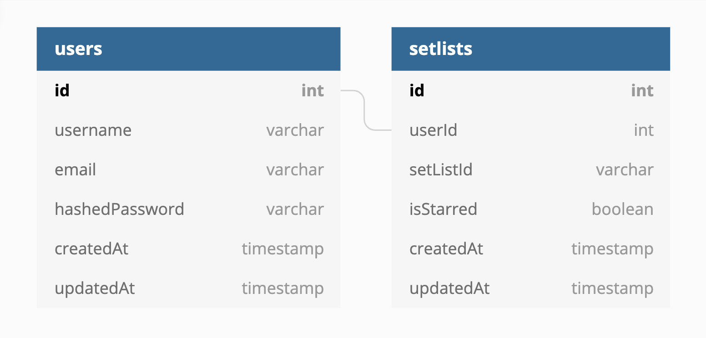

# setGuru

*By Erin Shields*

Check out a live version of **setGuru** here: [setGuru Live](http://setguru.herokuapp.com)

setGuru is a clone of the website Setlist.fm, a site where users can view setlists from various live shows/concerts. The backend of setGuru is built with Express.js with a PostgreSQL database. Frontend rendering is handled with React/Redux. The app leverages the [Setlist.fm API](https://api.setlist.fm/docs/1.0/index.html) to source, search, and display setlist data. 

**Table of Contents**
* [Technologies](#technologies)
* [setGuru Overview](#setguru-overview)
* [Installation](#installation)
* [Application Architecture](#application-architecture)
* [Backend Overview](#backend-overview)
* [Frontend Overview](#frontend-overview)
* [User Authorization](#user-authentication)
* [Known Bug Log](#known-bug-log)
* [Final Thoughts & Next Steps](#final-thoughts-and-next-steps)

## Technologies
* React
* Redux
* Express.js
* Sequelize
* PostgreSQL
* Heroku

## setGuru Overview

setGuru is a full-stack web app that allows users to make an account, find, save, and comment on the setlists of concerts they've attended, as well as view additional information about the relevant artists.

> Curent Status: Ongoing Development

### setGuru in Action:


## Installation
1. Clone this repository:
    ```bash
    $ git clone https://github.com/theuncoolgirl/setguru.git
    ```
2. Install npm dependencies:
    ```bash
    $ npm install
    ```
3. Create a **.env** file based on the **.envexample** with proper settings for your development environment.
4. Setup your PostgreSQL user, password and database and make sure it matches your **.env** file with CREATEDB privileges.
5. Migrate and seed your database:
    ```bash
    $ npm run db:migrate
    $ npm rund db:seed:all
    ```
6. For development, you'll need to run `npm start` in both main project directory and client directory so that both frontend and backend servers run (utilizing a proxy server). 
    ```bash
    $ npm start
    $ cd client/
    $ npm start
    ```

## Application Architecture
setGuru is a fullstack application. The majority of its logic occurs within the frontend's Redux store, along with interactions with the Setlist.fm. For the styling of its frontend React components, setGuru utilizes the Material UI framework.

The backend is built with [Express](https://expressjs.com/) and serves the front end, fetches data from the [PostgreSQL](https://www.postgresql.org/) database with [Sequelize](https://sequelize.org/master/manual/model-querying-basics.html), responds to frontend requests, and acts as an intermediary to serve setlist data from the [Setlist.fm API](https://api.setlist.fm/docs/1.0/index.html) via a customized version of the [setlistfm-js](https://www.npmjs.com/package/setlistfm-js) library. 

The database schema is relatively simple as the majority of the setlist data is pulled directly from the Setlist.fm API.

### Database Schema


## Backend Overview
setGuru utilizes an Express server with a PostgreSQL database. The backend server is simple in that it is responsible for serving the frontend, receiving requests and fetching relevant data from the database, and acting as an intermediary between the frontend and the Setlist.fm API (which does not allow for requests to be made by the frontend). 

The setlistfm-js library is used as a wrapper to more easily facilitate calls to the Setlist.fm API. An example utilizing the wrapper can be seen below, which is the equivalent of a call to the `/search/setlists` endpoint, with `artistName` and `page` included as query parameters:

```js
const searchResults = (searchTerm, page = 1) => {
    return setlistfmClient.searchSetlists({
        artistName: searchTerm,
        p: page
    })
        .then(function (results) {
            return results
        })
        .catch(function (error) {
            return error
        });
}
```

The `searchResults` helper function is then used in `PUT` requests to the `/api/search/` route, which acts as an intermediary to make the calls to the Setlist.fm API on the backend:

```js
router.put('/', handler(async (req, res) => {
    const { searchQuery, page } = req.body;
    if (searchQuery) {
        const results = await searchResults(searchQuery, page)
        return res.status(201).json({
            results,
        });
    } else {
        return res.status(404).end();
    }
}));
```

## Frontend Overview
On the frontend, setGuru utilizes React as its core logic and component architecture, along with Redux and the react-redux library to manage state and to make requests to the backend server to fetch data. Some hooks, such as the `useEffect()` hook are employed to allow for functional components. Future refactoring goals include utilizing additional hooks to avoid prop threading, along with other optimizations. 

The Redux store is used to manage information on tokens for authentication purpoess, search queries, and both setlist search results and specific details on setlists when the user is brought to a Setlist Detail Page. Pagination is employed on the Search Results page to limit the amount of data fetched from the Setlist.fm API and stored in the Redux store at any given moment. 

### Redux store logic for fetching and storing search results:
```js
const UPDATE_SEARCH_VALUE = 'setlistfm/search/UPDATE_SEARCH_VALUE'
const UPDATE_PAGE_NUMBER = 'setlistfm/search/UPDATE_PAGE_NUMBER'
const RECEIVE_SETLISTS = 'setlistfm/search/RECEIVE_SETLISTS'

const receiveSetlists = value => ({ type: RECEIVE_SETLISTS, value });
const updateSearchValue = value => ({ type: UPDATE_SEARCH_VALUE, value });
const updatePageNumber = value => ({ type: UPDATE_PAGE_NUMBER, value });

export const actions = {
    receiveSetlists,
    updateSearchValue,
    updatePageNumber
};

const getSetlists = () => {
    return async (dispatch, getState) => {
        const { search: { searchQuery, page } } = getState();
        const response = await fetch('/api/search', {
            method: 'PUT',
            headers: { 'Content-Type': 'application/json' },
            body: JSON.stringify({ searchQuery, page }),
        });
        try {
            if (response.status >= 200 && response.status < 400) {
                const data = await response.json();
                dispatch(receiveSetlists(data));
            } else {
                console.error('Bad response');
            }
        } catch (e) {
            console.error(e);
        }
    }
}

export const thunks = {
    getSetlists,
}

const initialState = {
    setlists: { setlist: {} },
    page: 1
};

function reducer(state = initialState, action) {
    switch (action.type) {
        case UPDATE_SEARCH_VALUE:
            return {
                ...state,
                searchQuery: action.value
            }
        case UPDATE_PAGE_NUMBER:
            return {
                ...state,
                page: action.value
            }
        case RECEIVE_SETLISTS:
            return {
                ...state,
                setlists: action.value.results
            }
        default:
            return state;
    }
};

export default reducer;
```

### Material UI
setGuru also employed the Material UI framework for elegant styling and responsive components. Material UI's `makeStyles` hook allows for simple, optimized component stylings that allow for customization and cohesion in the styling across components, with minimal code, as they can be consolidated into a single instance of the hook as since in the `/client/src/styles.js` file. 

```js
import { fade, makeStyles } from '@material-ui/core/styles';
import background from './images/concert.jpg';

const useStyles = makeStyles((theme) => ({
    accordion: {
        backgroundColor: "#3e3f4d",
        color: "white",
        border: '1px solid rgba(0, 0, 0, .125)',
    },
    accordionHeading: {
        fontSize: theme.typography.pxToRem(15),
        fontWeight: theme.typography.fontWeightRegular,
    },
    accordionRoot: {
        width: '100%',
    },
    appbar: {
        background: 'linear-gradient(45deg, #000000 5%, #752625 45%, #CD9337 95%)',
    },

    // code removed for brevity
    
}));

export default useStyles;
```

## User Authentication
Unauthroized users are only able to view the Login and Signup pages. To search for and view setlists, and to add them to their own collection of setlists, they must create an account and log in (or utilize the demo user login). 

When a user submits information on the `/signup` page, a fetch POST request is made to the Express backend `/api/users/` route, and the data is first validated.The `express-validator` library is used to assist in validating user inputs as well as serving up custom validation error messaging that is passed and visible to the user on the frontend should there be any errors. If there are no errors, the submitted password is hashed using the Bcrypt hasing algorithm, and a new user object is created using Sequelize to then save to the `Users` table in the PostgreSQL database. Login and Signup routes also utilize the `express-async-handler` library to assist help manage authentication and validation processes.

```js
const bcrypt = require('bcryptjs');
const express = require('express');
const asyncHandler = require('express-async-handler');
const { User } = require('../db/models');
const { validationResult } = require('express-validator');
const { validateSignup } = require('./utils/validators');

const router = express.Router();

router.post(
    '/',
    validateSignup,
    asyncHandler(async (req, res) => {
        const errors = validationResult(req);
        if (!errors.isEmpty()) {
            return res.status(422).json({ errors: errors.array() })
        }
        const { 
            username,
            email,
            password
        } = req.body;

        const hashedPassword = await bcrypt.hash(password, 10);
        const user = await User.create({
            username,
            email,
            hashedPassword
        });
        res.status(201).json({
            user: { id: user.id }
        });
    }));
```

After signup, the user will then need to log in in order to access the rest of setGuru. In a similar fashion to `/signup`, on the `/login` page, when a user submits their login credentials, they will first be validated with the help of the `express-validator` library. Then, if a user is located wiht the same email in the PostgreSQl database, and the credentials match what is on file, an JSON Web Token will be generated and added to the Redux store, which allows for access to the protected portions of the site, and persists until the user logs out. On the backend, the `jsonwebtoken` and `express-bearer-token` libraries are utilized to facilitate the generation of the authorization token. 

 ```js
 const express = require('express');
const asyncHandler = require('express-async-handler');
const { getUserToken } = require('./utils/auth');
const { validationResult } = require('express-validator');
const { validateLogin } = require('./utils/validators');
const { User } = require('../db/models');
const bcrypt = require('bcryptjs');

const router = express.Router();

router.put(
    '/', 
    validateLogin,
    asyncHandler(async (req, res, next) => {
        const errors = validationResult(req);
        if (!errors.isEmpty()) {
            return res.status(422).json({ errors: errors.array() })
        }

        const { email, password } = req.body;
        const user = await User.findOne({ where: { email } });

        if (!user) {
            const err = new Error('Login failed');
            err.status = 404;
            err.title = 'Login failed';
            err.errors = ['No user with provided email found'];
            return next(err);
        }
        const match = await bcrypt.compare(password, user.hashedPassword.toString());

        if (!match) {
            const err = new Error('Login failed');
            err.status = 401;
            err.title = 'Login failed';
            err.errors = ['Invalid credentials'];
            return next(err);
        }
        const token = getUserToken(user);
        return res.status(201).json({
            token,
            userId: user.id
        });
}));

module.exports = router;
``` 

## Known Bug Log

## Final Thoughts and Next Steps
* Spotify integration
* Suggestive search implementation


